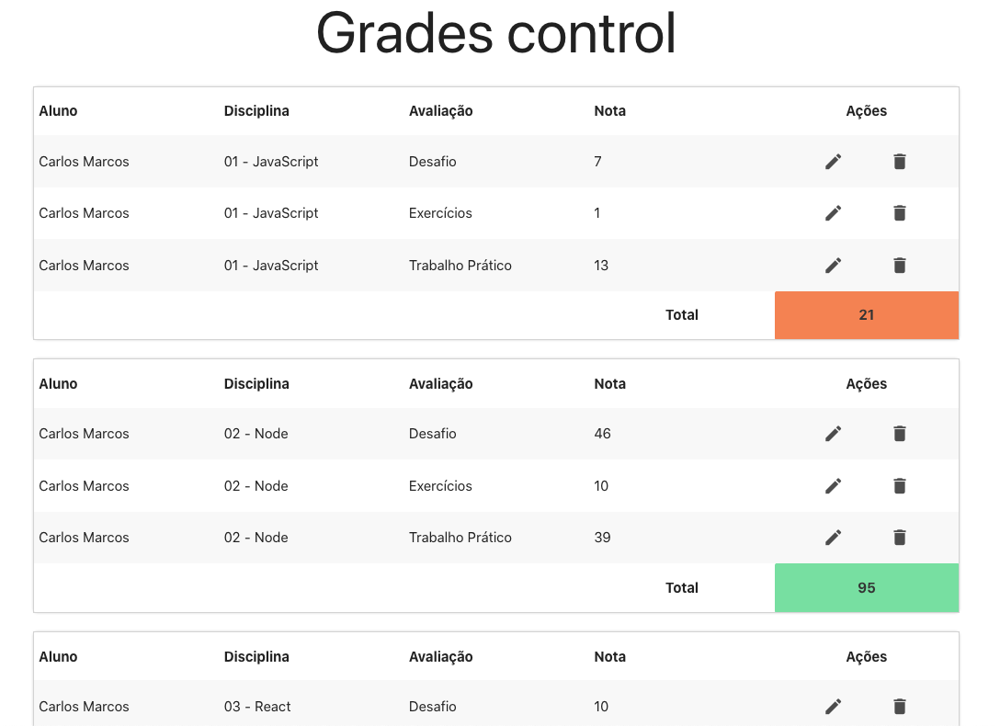

# GRADES CONTROL SIMULATOR
---   
## Abstract   
This is an application made to learn React. The backend simulates a grading system for three students. This grading system randomizes some grades to three subjects and three evaluation types and then stores it on a json file. The frontend (made with React) gets the information from the json file and show to the user, which can edit ou erase the grades, replacing it in the json file. 

## Overview
Here is a screenshot of the application

## A little more about it

### Motivation
This is a simple application made to learn a little bit about React and to practice front-end and back-end in general.

### Ingredients
This front-end part of the application uses the yarn package manager and the main dependency is materialize-css. The bacend is using JS experimental modules. In the next section of this README will be the command to run the application.

### How to run in development mode
First of all, install the front-end and back-end modules using yarn. To do this simple run `yarn` in the front-end root folder and in the back-end root folder. Everything is supposed to run well and everyone will be happy. The next step is to serve the backend by running `node --experimental-modules ./src/app.js` in the back-end folder and starting the front-end executing `yarn start` in the front-end folder and the application will start and run in localhost in the port 3000. So Open [http://localhost:3000](http://localhost:3000) to view it in the browser.

### That's it?   
Yep! That's it! Super simple.

## Disclaimer
This is only for study purposes. :)